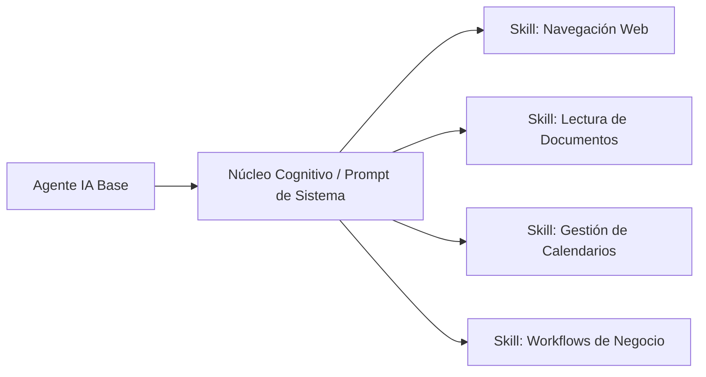
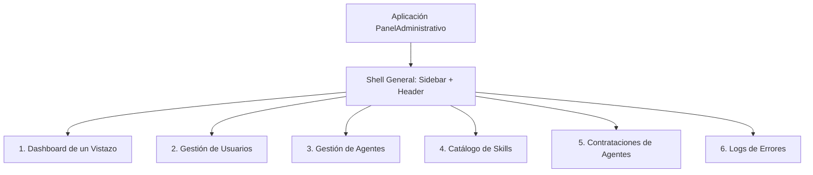

# AgentHub - Especificaciones del Panel Administrativo (Vision to Specs)

> **Documento:** Especificaciones Funcionales, de Interfaz y Arquitectura Técnica (Specs)  
> **Producto:** Panel de Administración - AgentHub  
> **Modelo de Negocio:** Alquiler de Agentes de Inteligencia Artificial (*Agents-as-a-Service / AaaS*)  
> **Versión:** 2.1.0  
> **Estado:** Especificación Detallada Aprobada para Maquetación de Referencia  

---

## 1. Visión y Estrategia de Producto (Vision Level)

### 1.1 Declaración de Visión
Convertir a **AgentHub** en la plataforma líder global para el aprovisionamiento, alquiler, configuración y monitoreo de fuerza laboral digital inteligente. Permitir a empresas de cualquier escala alquilar agentes de IA autónomos y preconfigurados, listos para integrarse en flujos de trabajo corporativos en cuestión de minutos y con habilidades modulares intercambiables.

### 1.2 El Problema
- Desarrollar agentes de IA internos requiere semanas de ingeniería especializada, costes elevados de infraestructura y mantenimiento complejo de modelos y conectores.
- Las empresas necesitan resolver tareas operativas inmediatas (investigación de mercado, extracción de datos de documentos, agendamiento de reuniones con clientes, flujos de ventas y atención) sin incurrir en contratación masiva ni desarrollo de software a medida desde cero.
- Falta de gobernanza, observabilidad y control de costes en implementaciones descentralizadas de IA generativa dentro de las organizaciones.

### 1.3 La Solución: Alquiler de Agentes Preconfigurados (AaaS)
AgentHub ofrece un catálogo de agentes preentrenados y preconfigurados que las empresas pueden alquilar bajo demanda (por hora, tarea o suscripción periódica). Los agentes pueden equiparse dinámicamente con conjuntos de herramientas (*skills*) especializadas según el caso de uso del cliente.

---

## 2. Roles y Arquetipos de Usuario (Personas)

| Rol | Descripción | Responsabilidades Clave en el Panel |
| :--- | :--- | :--- |
| **Super Administrador (AgentHub Ops)** | Operador interno de AgentHub. | Gestión global de la flota, definición de modelos base, catálogo de habilidades, fijación de tarifas de alquiler y salud de la infraestructura global. |
| **Administrador de Cliente / Tenant** | Responsable de operaciones o TI de la empresa que alquila agentes. | Contratación y alquiler de agentes, asignación de habilidades, conexión de credenciales corporativas, supervisión de consumo/presupuesto y políticas de seguridad. |
| **Supervisor Operativo (Human-in-the-Loop)** | Líder de equipo o gestor que delega tareas a los agentes. | Asignación de objetivos de negocio, revisión de entregables generados por agentes, auditoría de logs y ajuste fino de instrucciones operativas. |

---

## 3. Matriz del Ecosistema de Habilidades (*Skills Ecosystem*)

Una **Skill (Habilidad)** en AgentHub es un módulo plug-and-play de capacidades funcionales autónomas dotado de herramientas de ejecución en sandbox, políticas de seguridad y conectores a servicios externos.

### 3.1 Habilidad: Navegación Web Autónoma (`skill-web-browsing`)
- **Propósito:** Exploración activa de internet, recolección de datos en tiempo real, análisis competitivo y automatización en navegadores sin cabeza (*headless browsers*).
- **Capacidades Técnicas:** Búsqueda contextual, scraping ético (`robots.txt`), parseo de DOM dinámico y síntesis con citas estructuradas.

### 3.2 Habilidad: Lectura y Procesamiento de Documentos (`skill-doc-reader`)
- **Propósito:** Ingesta multimodal, comprensión semántica y extracción estructurada a partir de archivos corporativos.
- **Capacidades Técnicas:** Compatibilidad PDF/OCR, DOCX, XLSX, CSV; arquitectura RAG con embeddings y búsqueda vectorial.

### 3.3 Habilidad: Gestión de Calendarios y Agendamiento (`skill-calendar-ops`)
- **Propósito:** Coordinación de agenda ejecutiva, negociación horaria y resolución autónoma de conflictos entre múltiples husos horarios.
- **Capacidades Técnicas:** Conexión bidireccional vía OAuth 2.0 (Google Calendar, Outlook/365), generación de enlaces de videoconferencia y reprogramación dinámica.

### 3.4 Habilidad: Despliegue para Tareas de Negocio Específicas (`skill-business-workflows`)
- **Propósito:** Ejecución de flujos de trabajo lógicos complejos y orquestación con sistemas externos de negocio.
- **Capacidades Técnicas:** Conectores REST/GraphQL con CRM/ERP (HubSpot, Salesforce), disparadores basados en eventos (*event-driven*) y compuertas *Human-in-the-Loop*.

---

## 4. Arquitectura de Navegación e Interfaz (UI/UX Specs)

### 4.1 Layout General del Panel
- **Barra Lateral Persistente (Sidebar):** Ubicada a la izquierda, fija en pantallas de escritorio, colapsable en móvil. Contiene el logotipo de AgentHub, selector de las 6 secciones principales, indicador de estado de la plataforma y perfil de sesión.
- **Barra Superior (Top Header):**
  - Título dinámico o *breadcrumbs* según la sección activa.
  - Buscador global contextual (placeholder con atajo de teclado decorativo).
  - Indicador de estado de la red/agentes en tiempo real.
  - **Selector de Modo Claro / Modo Oscuro (*Theme Toggle*):** Alterna la clase `.dark` en el elemento raíz `<html>` utilizando la paleta nativa `dark:` de Tailwind CSS y persistiendo la preferencia en `localStorage`.
  - Menú de perfil y notificaciones.
- **Contenedor Principal (`<main>`):** Renderiza dinámicamente la sección seleccionada sin recargar la página, gestionado por estados en JavaScript nativo.

---

## 5. Especificaciones Detalladas por Sección (Mínimo 3 Requisitos Visuales/Interactivos Concretos por Vista)

Para cada una de las 6 secciones accesibles desde la navegación lateral, se definen los componentes específicos, su contenido y su comportamiento exacto:

### 5.1 Sección 1: Dashboard de un Vistazo (*Overview*)

#### [REQ-1.1] Componente `MetricGridCards` (Cuadrícula 2x2 de Tarjetas de Métrica)
- **Nombre del Componente:** `MetricGridCards`
- **Contenido:**
  - Contenedor de cuadrícula adaptable: 1 columna en móviles, cuadrícula 2x2 en pantallas medianas (`sm:grid-cols-2`) y 4 columnas en escritorios amplios (`lg:grid-cols-4`).
  - Cuatro tarjetas con datos clave:
    1. *Ingresos Totales del Mes:* Etiqueta `"Ingresos del Mes (MRR)"`, valor `"$128,450.00"`, porcentaje `"+14.2% vs mes anterior"`.
    2. *Pérdida por Descuentos y Cupones:* Etiqueta `"Pérdida por Descuentos/Cupones"`, valor `"-$14,320.00"`, porcentaje `"-2.4% vs mes anterior"`.
    3. *Agentes Activos en Clientes:* Etiqueta `"Agentes Activos Globales"`, valor `"1,248"`, subtítulo `"En 142 organizaciones"`.
    4. *Agentes en Estado de Fallo:* Etiqueta `"Agentes Fallando"`, valor `"12"`, badge de urgencia `"0.95% de la flota"`.
  - Cada tarjeta incorpora un icono vectorial temático dentro de un avatar circular con fondo traslúcido.
- **Comportamiento:**
  - Los valores se renderizan con tipografía monoespaciada de alta legibilidad (`font-semibold text-2xl`).
  - El contador de "Agentes Fallando" reacciona dinámicamente: si un usuario resuelve un error desde la sección de Logs, el valor decrementa automáticamente en pantalla.

#### [REQ-1.2] Componente `MetricCardThemeElevation` (Colores de Acento y Elevación)
- **Nombre del Componente:** `MetricCardThemeElevation`
- **Contenido:**
  - Estructura de tarjeta con bordes neutros delgados (`border border-slate-200 dark:border-slate-800`), fondo contrastado (`bg-white dark:bg-slate-900`) y esquinas redondeadas amplias (`rounded-xl`).
  - Colores de acento diferenciados por tipo de métrica:
    - *Ingresos:* Acento verde esmeralda (`text-emerald-600 dark:text-emerald-400 bg-emerald-50 dark:bg-emerald-950/40`).
    - *Descuentos:* Acento ámbar cálido (`text-amber-600 dark:text-amber-400 bg-amber-50 dark:bg-amber-950/40`).
    - *Agentes Activos:* Acento azul índigo (`text-indigo-600 dark:text-indigo-400 bg-indigo-50 dark:bg-indigo-950/40`).
    - *Agentes Fallando:* Acento rojo carmesí (`text-rose-600 dark:text-rose-400 bg-rose-50 dark:bg-rose-950/40`).
- **Comportamiento:**
  - Aplica elevación mediante sombra sutil en reposo (`shadow-sm`) y una transición suave de realce al posar el cursor (`hover:shadow-md hover:-translate-y-0.5 transition-all duration-200`).

#### [REQ-1.3] Componente `WeeklyActivityPlaceholder` (Marcador de Gráfico Semanal con Bordes Discontinuos)
- **Nombre del Componente:** `WeeklyActivityPlaceholder`
- **Contenido:**
  - Un contenedor `div` de ancho completo (`w-full`) con altura mínima de `300px`.
  - Borde discontinuo pronunciado (`border-2 border-dashed border-slate-300 dark:border-slate-700 rounded-2xl`).
  - Fondo sutilmente contrastado (`bg-slate-50/50 dark:bg-slate-900/30`).
  - En el centro: icono de gráfico de barras vectorial, encabezado tipográfico centrado `"Gráfico de Actividad Semanal de la Flota"` y subtítulo explicativo `"Monitoreo de tareas ejecutadas vs excepciones registradas (Lunes a Domingo)"`.
  - Representación visual simulada con 7 barras verticales (CSS) de alturas proporcionales con gradientes índigo/esmeralda para transmitir actividad en vivo.
- **Comportamiento:**
  - Controles simulados en la esquina superior derecha (botones píldora `"7 Días"`, `"30 Días"`) que alternan visualmente el estado activo al hacer clic.

---

### 5.2 Sección 2: Gestión de Usuarios (*User Management*)

#### [REQ-2.1] Componente `UserTableContainer` (Tabla de Usuarios con Estados y Planes)
- **Nombre del Componente:** `UserTableContainer`
- **Contenido:**
  - Encabezado con buscador de usuarios y botón `"Nuevo Usuario"`.
  - Tabla semántica (`<table>`) con columnas: `Usuario (Avatar + Nombre)`, `Email Corporativo`, `Plan Contratado`, `Estado de Cuenta`, `Acciones`.
  - Cada fila muestra:
    - Avatar circular con iniciales y nombre del cliente junto con su cargo/empresa.
    - Email en tipografía monoespaciada atenuada.
    - Badges de Plan: `Starter Fleet` (slate), `Business Pro` (indigo), `Enterprise Fleet` (amber con corona decorativa).
    - Badges de Estado: `Activo` (píldora verde con punto de pulso animado), `Suspendido` (píldora ámbar), `Inactivo` (píldora gris).
- **Comportamiento:**
  - Filas con efecto cebra sutil y resaltado al pasar el ratón (`hover:bg-slate-50 dark:hover:bg-slate-800/50 transition-colors`).
  - Soporte de desplazamiento horizontal fluido en pantallas estrechas (`overflow-x-auto`).

#### [REQ-2.2] Componente `UserActionDropdown` (Menú Contextual Flotante de Acciones)
- **Nombre del Componente:** `UserActionDropdown`
- **Contenido:**
  - Botón de disparo con icono de tres puntos verticales (`svg`) y etiqueta accesible `aria-label="Acciones de usuario"`.
  - Menú desplegable flotante posicionado de forma absoluta (`absolute right-0 mt-2 w-52 bg-white dark:bg-slate-800 rounded-xl shadow-2xl border border-slate-100 dark:border-slate-700 z-30`).
  - Opciones con iconos SVG:
    1. `"Ver detalles"` (abre el modal con el registro completo).
    2. `"Editar Plan / Cuota"` (opción de administración de límites).
    3. `"Suspender Acceso"` (conmutador rápido de seguridad).
    4. `"Eliminar Usuario"` (resaltado en rojo tenue con icono de papelera).
- **Comportamiento:**
  - Abre y cierra mediante toggle.
  - Se cierra automáticamente al hacer clic en cualquier opción, al presionar la tecla `Escape` o al hacer clic fuera del menú (*click-outside listener*).

#### [REQ-2.3] Componente `UserDetailsModal` (Modal Overlay con Ficha Completa del Usuario)
- **Nombre del Componente:** `UserDetailsModal`
- **Contenido:**
  - Fondo oscuro translúcido con desenfoque de fondo (`fixed inset-0 bg-slate-900/60 dark:bg-black/80 backdrop-blur-sm z-50 flex items-center justify-center p-4`).
  - Tarjeta modal centrada (`max-w-2xl w-full bg-white dark:bg-slate-900 rounded-2xl shadow-2xl border border-slate-200 dark:border-slate-800 overflow-hidden`).
  - Cabecera con avatar grande, nombre del cliente, ID único (`UUID`), badge del plan y botón de cierre `"X"`.
  - Cuerpo dividido en 2 columnas:
    - *Columna 1:* Detalles de contacto, empresa, sector, fecha de registro y última conexión.
    - *Columna 2:* Métricas de consumo (Agentes asignados, tokens consumidos en el ciclo, facturación acumulada del mes y límite de crédito).
  - Pie con botones `"Descargar Informe"` y `"Cerrar"`.
- **Comportamiento:**
  - Se abre al pulsar `"Ver detalles"` en el dropdown.
  - Se cierra de forma verificable por 3 vías: (a) botón `"X"` o botón `"Cerrar"`, (b) clic en el área del fondo oscuro exterior (*backdrop*), y (c) pulsación de la tecla `Escape`.

---

### 5.3 Sección 3: Gestión de Agentes (*Agent Fleet Management*)

#### [REQ-3.1] Componente `AgentFleetTable` (Listado de Instancias y Estados Operativos)
- **Nombre del Componente:** `AgentFleetTable`
- **Contenido:**
  - Tabla de control operativo de agentes. Columnas: `Agente & Modelo Base`, `Organización / Propietario`, `Estado de Ejecución`, `Habilidades Equipadas`, `Acciones`.
  - Muestra el nombre identificador del agente (ej. `Atlas - Research Analyst`, `Hermes - Calendar Sync`, `Valkyrie - Doc Extractor`, `Aegis - Security Ops`), acompañado del badge del modelo base subyacente (`Gemini 1.5 Pro`, `Claude 3.5 Sonnet`, `GPT-4o`).
  - Insignia cromática de Estado:
    - `Activo`: Verde esmeralda con indicador de pulso en tiempo real.
    - `Inactivo`: Ámbar con texto descriptivo "En Pausa".
    - `Fallando`: Rojo carmesí con icono de advertencia parpadeante.
- **Comportamiento:**
  - Permite ordenar o filtrar agentes según su estado operativo mediante píldoras de filtro en la cabecera.

#### [REQ-3.2] Componente `AgentSkillsCollapsible` (Acordeón de Skills con Transición Suave)
- **Nombre del Componente:** `AgentSkillsCollapsible`
- **Contenido:**
  - En reposo: Muestra una píldora resumen compacta (ej. `"3 Skills equipadas"`) junto con un botón interactivo dotado de un icono de flecha hacia abajo (`chevron-down`).
  - Al expandirse: Revela una lista desplegable con tarjetas miniatura de cada habilidad asignada (`Navegación Web`, `Lector de Documentos`, `Gestión de Calendarios`), incluyendo su icono específico, versión y estado de conexión segura.
- **Comportamiento:**
  - Las skills están ocultas por defecto (`hidden` o `max-h-0`).
  - Al hacer clic en el botón expansor, se despliegan hacia abajo con una transición fluida en CSS (`transition-all duration-300 ease-in-out`), y el icono de flecha rota 180 grados suavemente para indicar el estado expandido.

#### [REQ-3.3] Componente `AgentPromptConfigModal` (Modal de Configuración y System Prompt)
- **Nombre del Componente:** `AgentPromptConfigModal`
- **Contenido:**
  - Modal accesible centrado con título `"Configuración y Directrices del Agente"`.
  - Muestra el nombre del agente, modelo asociado y un área de texto estilizada tipo editor de código (`font-mono text-sm bg-slate-950 text-slate-100 p-4 rounded-xl border border-slate-800`) con el *System Prompt* actual preconfigurado (personalidad, restricciones de seguridad, directrices de actuación y herramientas autorizadas).
  - Parámetros configurables: Slider de temperatura del modelo (`0.0` a `1.0`) y selector de timeout de ejecución.
  - Pie con botones `"Guardar Configuración"` y `"Cancelar"`.
- **Comportamiento:**
  - Se activa desde la opción `"Configurar"` del dropdown de acciones de cada agente.
  - Admite cierre por botón, por clic en el backdrop o por la tecla `Escape`.
  - Muestra una notificación visual simulada de éxito al guardar cambios.

---

### 5.4 Sección 4: Catálogo de Skills (*Skills Registry & Capabilities*)

#### [REQ-4.1] Componente `SkillDefinitionBanner` (Banner Explicativo de Concepto de Skill)
- **Nombre del Componente:** `SkillDefinitionBanner`
- **Contenido:**
  - Banner horizontal prominente situado inmediatamente debajo del título de la sección.
  - Fondo degradado suave (`bg-gradient-to-r from-indigo-50 to-purple-50 dark:from-indigo-950/40 dark:to-purple-950/30 border border-indigo-200 dark:border-indigo-800/60 rounded-2xl p-6`).
  - Contiene un icono vectorial de núcleo modular / caja de herramientas, título destacado `"¿Qué es una Skill en AgentHub?"`, y el párrafo explicativo oficial:
    > *"Una **Skill (Habilidad)** es una unidad funcional autónoma que equipa a un Agente IA con herramientas para interactuar con el entorno real: ejecutar navegación web en sandbox seguro, procesar y consultar documentos corporativos con OCR y RAG, negociar y agendar calendarios vía OAuth o disparar flujos de trabajo en CRMs/ERPs empresariales."*
- **Comportamiento:**
  - Componente informativo persistente pero con un botón discreto para colapsar/minimizar si el usuario prefiere ahorrar espacio visual.

#### [REQ-4.2] Componente `SkillCatalogGrid` (Cuadrícula de Fichas de Habilidades)
- **Nombre del Componente:** `SkillCatalogGrid`
- **Contenido:**
  - Cuadrícula responsiva de tarjetas (`grid grid-cols-1 md:grid-cols-2 lg:grid-cols-3 gap-6`).
  - Cada tarjeta presenta:
    1. Icono de la habilidad enmarcado en un fondo circular de color propio.
    2. Nombre de la habilidad (ej. `Navegación Web Autónoma`, `Lector de Documentos Multimodal`, `Gestión de Calendarios Ejecutivos`, `Workflows Empresariales`).
    3. Descripción funcional concisa de 2 a 3 líneas.
    4. **Indicador de Adopción:** Insignia destacada con el recuento de agentes que la tienen equipada (ej. `"842 Agentes activos"`, `"1,120 Agentes activos"`).
    5. Badge de nivel de seguridad de sandbox (`Sandbox Nivel 2 - Red Restringida`, `OAuth 2.0 Certificado`, `RAG Local`).
- **Comportamiento:**
  - Efecto de elevación e iluminación de borde al pasar el cursor (`hover:border-indigo-500 hover:shadow-lg transition-all`).

#### [REQ-4.3] Componente `SkillActionDropdown` (Menú de Acciones de Catálogo)
- **Nombre del Componente:** `SkillActionDropdown`
- **Contenido:**
  - Botón de tres puntos en la esquina superior de cada tarjeta de habilidad.
  - Dropdown flotante con opciones:
    - `"Ver Detalles Técnicos"` (abre modal con lista de funciones `tools` y esquema JSON de parámetros).
    - `"Ver Agentes Vinculados"` (filtra y muestra las instancias que usan la skill).
    - `"Editar Parámetros Globales"` (permite ajustar cuotas de uso y precio de alquiler).
    - `"Desactivar del Catálogo"` (marcado en color rojo para impedir nuevas contrataciones).
- **Comportamiento:**
  - Cierre automático al pulsar fuera o presionar `Escape`.
  - Al seleccionar `"Ver Detalles Técnicos"`, despliega el modal técnico correspondiente.

---

### 5.5 Sección 5: Contrataciones de Agentes (*Leasing Contracts & Financials*)

#### [REQ-5.1] Componente `ContractLeasingTable` (Tabla Comercial de Contratos)
- **Nombre del Componente:** `ContractLeasingTable`
- **Contenido:**
  - Tabla que lista contratos activos y pasados de alquiler de agentes.
  - Columnas: `Código & Cliente`, `Agente Alquilado`, `Skills Contratadas`, `Periodo de Vigencia`, `Total Facturado`, `Estado`, `Acciones`.
  - Cada fila muestra:
    - Identificador de contrato (ej. `CTR-2026-104`, `CTR-2026-098`) y nombre de la empresa cliente.
    - Nombre del agente asignado con icono de tipo de modelo.
    - Grupo de badges condensados con las skills incluidas en el paquete de alquiler.
    - Fechas de inicio y fin/renovación en formato estándar `DD/MM/AAAA`.
    - Importe total pagado mensual en tipografía monoespaciada en negrita (ej. `"$850.00 / mes"`).
    - Estado: `Activo (Auto-renovación)` (verde), `Finalizado` (gris), `Pendiente de Pago` (ámbar).
- **Comportamiento:**
  - Fila interactiva con soporte de menú contextual y filtros rápidos por estado de contrato.

#### [REQ-5.2] Componente `ContractActionDropdown` (Menú de Acciones de Contrato)
- **Nombre del Componente:** `ContractActionDropdown`
- **Contenido:**
  - Botón de acciones por fila que despliega el menú contextual con las siguientes opciones:
    1. `"Ver detalles"` (abre el modal con el desglose económico y de skills).
    2. `"Descargar Factura PDF"` (simulación de descarga de comprobante fiscal).
    3. `"Pausar Renovación"` (conmuta el estado de renovación automática).
    4. `"Cancelar Contrato"` (acción crítica con advertencia visual en rojo).
- **Comportamiento:**
  - Despliegue flotante absoluto con sombra elevada y autocierre al hacer clic fuera o presionar `Escape`.

#### [REQ-5.3] Componente `ContractBreakdownModal` (Modal de Desglose Completo y Precios Unitarios)
- **Nombre del Componente:** `ContractBreakdownModal`
- **Contenido:**
  - Modal de formato recibo/factura comercial detallada.
  - Cabecera con número de contrato, nombre de la empresa cliente, CIF/NIF ficticio y método de pago registrado (ej. `"Visa terminada en •••• 4821"`).
  - **Tabla de Desglose de Precios por Concepto:**
    - Fila 1: *Cuota Base de Cómputo del Agente (Instancia dedicada 24/7):* `$450.00 / mes`.
    - Filas siguientes: **Lista desglosada de cada Skill contratada con su precio unitario individual:**
      - `Skill: Navegación Web Autónoma (High-Speed Headless):` `$120.00 / mes`
      - `Skill: Lectura y Procesamiento de Documentos (OCR + Vector DB):` `$180.00 / mes`
      - `Skill: Gestión de Calendarios y Agendamiento (OAuth 2-Way):` `$100.00 / mes`
    - Fila de descuentos: *Descuento por Cupón Promocional (`STARTUP2026` - 10%):* `-$85.00 / mes`.
    - Fila de total: **Importe Total Neto Pagado:** `"$765.00 / mes"`.
  - Botones al pie: `"Imprimir / Exportar PDF"` y `"Cerrar"`.
- **Comportamiento:**
  - Se abre al presionar `"Ver detalles"` en el dropdown de contrataciones.
  - Soporta cierre accesible mediante botón `X`, botón `"Cerrar"`, clic en backdrop exterior y tecla `Escape`.

---

### 5.6 Sección 6: Logs de Errores (*Diagnostics & Incident Response*)

#### [REQ-6.1] Componente `ErrorLogTable` (Registro de Errores con Badges de Gravedad)
- **Nombre del Componente:** `ErrorLogTable`
- **Contenido:**
  - Tabla de telemetría de incidentes con columnas: `Marca de Tiempo`, `Agente Afectado`, `Gravedad`, `Tipo de Error`, `Descripción`, `Estado`, `Acciones`.
  - Campos detallados por fila:
    - `Timestamp`: Fecha y hora en formato ISO/Local legible (ej. `14 Sep 2026 - 17:42:10 UTC`).
    - `Agente`: Nombre del agente con enlace directo a su ficha.
    - `Tipo de Error`: Código técnico (ej. `RATE_LIMIT_EXCEEDED`, `OAUTH_TOKEN_EXPIRED`, `SANDBOX_TIMEOUT`, `CONTEXT_LENGTH_EXCEEDED`).
    - `Descripción`: Resumen textual explicativo del fallo.
    - **Badges de Gravedad de Alto Contraste:**
      - 🔴 **`CRITICAL`:** Rojo intenso (`bg-rose-100 text-rose-800 border-rose-200 dark:bg-rose-950/60 dark:text-rose-300 dark:border-rose-800`).
      - 🟠 **`HIGH`:** Naranja brillante (`bg-orange-100 text-orange-800 border-orange-200 dark:bg-orange-950/60 dark:text-orange-300 dark:border-orange-800`).
      - 🟡 **`MEDIUM`:** Ámbar cálido (`bg-amber-100 text-amber-800 border-amber-200 dark:bg-amber-950/60 dark:text-amber-300 dark:border-amber-800`).
      - 🔵 **`LOW / INFO`:** Azul slate (`bg-sky-100 text-sky-800 border-sky-200 dark:bg-sky-950/60 dark:text-sky-300 dark:border-sky-800`).
- **Comportamiento:**
  - Permite filtrar por gravedad mediante botones de filtro rápido ubicados en la barra superior de la sección.

#### [REQ-6.2] Componente `ErrorActionDropdown` con Acción `"Marcar como Resuelto"`
- **Nombre del Componente:** `ErrorActionDropdown`
- **Contenido:**
  - Botón de tres puntos contextual en cada fila de error.
  - Dropdown con opciones:
    1. `"Ver detalles"` (abre el modal con la traza de ejecución técnica).
    2. `"Marcar como Resuelto"` (acción interactiva de remediación).
    3. `"Copiar Traza JSON"` (copia directa del payload de diagnóstico al portapapeles).
- **Comportamiento Interactivo Reactivo:**
  - Al pulsar `"Marcar como Resuelto"`, la fila del error actualiza inmediatamente su estado:
    - Se atenúa visualmente su opacidad (`opacity-50`).
    - El badge de gravedad se transforma en una insignia verde con el texto `"RESUELTO"`.
    - El contador de `"Agentes Fallando"` del Dashboard decrementa en 1 unidad en tiempo real para reflejar la mitigación del incidente.

#### [REQ-6.3] Componente `StackTraceModal` (Modal de Inspección y Traza de Error)
- **Nombre del Componente:** `StackTraceModal`
- **Contenido:**
  - Ventana modal centrada de diagnóstico avanzado con título `"Detalles del Incidente y Traza de Ejecución"`.
  - Resumen del agente, módulo de la skill afectada y código de estado HTTP o excepción de Python/Node.
  - **Bloque de Código de Traza Completa:** Contenedor estilizado en modo consola oscura (`bg-slate-950 text-emerald-400 font-mono text-xs p-4 rounded-xl border border-slate-800 overflow-x-auto select-all max-h-64`) que renderiza el *Stack Trace* formateado con líneas numeradas, payload de entrada y mensaje de excepción del Sandbox.
  - Botón `"Copiar al Portapapeles"` con confirmación visual rápida (`"¡Copiado!"`).
  - Botón de cierre en cabecera y pie.
- **Comportamiento:**
  - Se activa desde la opción `"Ver detalles"` del dropdown de logs.
  - Admite cierre por botón, clic en backdrop y tecla `Escape`.

---

## 6. Inventario de Componentes Reutilizables (*Design System Inventory*)

A continuación se formaliza el catálogo de componentes modulares reutilizables en toda la interfaz de AgentHub:

| Componente | Categoría | Propósito y Contenido | Clases Tailwind Clave | Comportamiento / Interacción |
| :--- | :--- | :--- | :--- | :--- |
| **`AppSidebar`** | Layout / Navegación | Barra lateral fija con logo, menú de las 6 secciones con iconos SVG, badge de versión e indicador de usuario. | `fixed left-0 top-0 h-screen w-64 bg-slate-900 text-slate-300 border-r border-slate-800 flex flex-col z-40` | Gestiona el cambio de vista activa sin recarga; añade clase `active` con fondo resaltado al ítem seleccionado. |
| **`TopHeader`** | Layout / Header | Barra superior con título de vista dinámica, buscador decorativo, badge de estado de salud y controles de usuario. | `h-16 border-b border-slate-200 dark:border-slate-800 bg-white/80 dark:bg-slate-900/80 backdrop-blur sticky top-0 z-30 px-6 flex items-center justify-between` | Mantiene visibilidad persistente y aloja el interruptor de tema. |
| **`ThemeToggle`** | Control Global | Botón interactivo con icono de sol y luna para alternar modos. | `p-2 rounded-xl bg-slate-100 dark:bg-slate-800 text-slate-600 dark:text-slate-300 hover:bg-slate-200 dark:hover:bg-slate-700 transition-colors` | Alterna la clase `.dark` en `document.documentElement` y almacena el estado en `localStorage`. |
| **`MetricCard`** | Visualización / Datos | Tarjeta de indicador de desempeño con contenedor de icono, título, valor grande y porcentaje. | `bg-white dark:bg-slate-900 p-6 rounded-2xl border border-slate-200 dark:border-slate-800 shadow-sm hover:shadow-md transition-all` | Admite actualización dinámica de valores numéricos en el DOM. |
| **`DataTable`** | Presentación / Tablas | Estructura de tabla accesible con encabezados claros, filas alternadas sutiles y scroll horizontal. | `w-full text-left text-sm text-slate-600 dark:text-slate-400 divide-y divide-slate-200 dark:divide-slate-800` | Renderiza filas dinámicas; soporte para ordenación o filtrado visual. |
| **`StatusBadge`** | Indicador / Píldora | Insignia redondeada con variantes de color (éxito, advertencia, peligro, info). | `inline-flex items-center px-2.5 py-0.5 rounded-full text-xs font-medium` con combinaciones de fondo y texto | Permite identificar visualmente el estado de agentes, usuarios, contratos y logs. |
| **`DropdownActionMenu`** | Menú Flotante | Menú emergente de opciones contextuales por fila de tabla o tarjeta. | `absolute right-0 mt-2 w-48 bg-white dark:bg-slate-800 rounded-xl shadow-xl border border-slate-200 dark:border-slate-700 z-50 py-1` | Abre/cierra por toggle; se cierra al presionar Escape o al hacer clic fuera del menú. |
| **`ModalDialogOverlay`** | Diálogo / Overlay | Ventana modal centrada con capa de desenfoque de fondo. | `fixed inset-0 z-50 flex items-center justify-center p-4 bg-slate-900/60 dark:bg-black/80 backdrop-blur-sm` | Bloquea scroll del fondo; se cierra con botón "X", tecla Escape o clic en el backdrop. |
| **`CollapsiblePanel`** | Acordeón / Expansible | Contenedor de contenido secundario oculto con animación de despliegue. | `transition-all duration-300 ease-in-out overflow-hidden` | Conmuta estado entre colapsado y expandido con rotación de chevron a 180°. |
| **`CodeSnippetViewer`** | Presentación / Código | Bloque de texto monoespaciado en modo oscuro para trazas o prompts. | `bg-slate-950 text-slate-100 font-mono text-xs p-4 rounded-xl border border-slate-800 overflow-x-auto` | Incluye botón de copiado rápido al portapapeles. |

---

## 7. Criterios de Aceptación Verificables (*Acceptance Criteria*)

Para certificar que la interfaz de administración cumple plenamente los requerimientos visuales, técnicos e interactivos, se establece la siguiente lista numerada de condiciones verificables:

1. **[AC-01] Navegación Lateral Persistente y Reactiva:**  
   Al hacer clic en cualquiera de los 6 enlaces de la barra lateral (`Dashboard`, `Usuarios`, `Agentes`, `Skills`, `Contrataciones`, `Logs`), el área principal de contenido (`<main>`) debe alternar inmediatamente a la vista seleccionada sin producir una recarga completa de la página. El enlace activo debe exhibir una clase de estilo resaltado visible tanto en modo claro como en modo oscuro.

2. **[AC-02] Conmutador de Modo Claro / Modo Oscuro con Persistencia:**  
   Al hacer clic en el botón `ThemeToggle` en la barra superior, la clase `dark` debe añadirse o removerse del elemento `<html>`, adaptando inmediatamente los estilos visuales mediante las utilidades `dark:` de Tailwind CSS. La preferencia seleccionada por el usuario debe persistir al recargar la página mediante almacenamiento en `localStorage`.

3. **[AC-03] Comportamiento Universal de Menús Desplegables (*Dropdowns*):**  
   Al hacer clic en el botón de tres puntos de cualquier fila (Usuarios, Agentes, Contrataciones, Logs) o tarjeta (Skills), el menú de acciones debe desplegarse con un `z-index` superior sin quedar recortado por contenedores con scroll. El menú debe cerrarse de forma verificable al: (a) seleccionar cualquier opción interna, (b) hacer clic en cualquier área externa de la pantalla, o (c) presionar la tecla `Escape`.

4. **[AC-04] Mecanismo de Cierre Triple en Diálogos Modales (*Modal Overlays*):**  
   Al abrir cualquier ventana modal (Ficha de Usuario, System Prompt de Agente, Desglose de Contrato, Traza de Error), la ventana debe aparecer centrada sobre un fondo semitransparente con desenfoque (`backdrop-blur`). Debe cerrarse con total fiabilidad a través de tres vías independientes:
   - Haciendo clic en el botón con icono de cruz (`X`) o en el botón `"Cerrar"` del pie.
   - Haciendo clic fuera del cuerpo del modal, sobre el fondo atenuado (*backdrop*).
   - Presionando la tecla `Escape` en el teclado.

5. **[AC-05] Transición Suave en Lista Colapsable de Habilidades (*Skills Accordion*):**  
   En la tabla de Gestión de Agentes, la lista de skills asociadas a cada agente debe encontrarse oculta en el estado inicial, mostrando únicamente un botón o píldora resumen. Al hacer clic en el control expansible, las habilidades deben desplegarse hacia abajo mediante una animación CSS fluida (`transition-all duration-300`), mientras el icono de flecha rota 180 grados. Un segundo clic debe replegar la lista suavemente.

6. **[AC-06] Marcador de Gráfico Semanal con Bordes Discontinuos:**  
   En la sección Dashboard, debajo de las cuatro tarjetas de métricas, debe mostrarse obligatoriamente un contenedor de ancho completo con bordes discontinuos (`border-dashed`), icono central de estadísticas y barras simuladas de distribución proporcional de lunes a domingo.

7. **[AC-07] Acción Interactiva "Marcar como Resuelto" en Logs:**  
   Al seleccionar la opción `"Marcar como Resuelto"` dentro del menú desplegable de cualquier log de error pendiente, el sistema debe ejecutar tres cambios visibles inmediatos:
   - La fila del log debe reducir su opacidad al 50-60%.
   - El badge de gravedad original debe reemplazarse por una insignia verde con el texto `"RESUELTO"`.
   - El contador de la tarjeta de métrica `"Agentes Fallando"` del Dashboard debe decrementar su valor en tiempo real.

8. **[AC-08] Desglose Individual de Precios por Skill en Contratos:**  
   Al seleccionar `"Ver detalles"` en la tabla de Contrataciones de Agentes, el modal emergente debe mostrar obligatoriamente un desglose pormenorizado que detalle el precio unitario individual de cada una de las skills contratadas (ej. Navegación Web, Lectura de Documentos, etc.), sumado a la cuota base del agente y deduciendo cupones de descuento aplicados.

9. **[AC-09] Accesibilidad WAI-ARIA y Ratios de Contraste:**  
   Todos los botones interactivos deben contar con etiquetas descriptivas (`aria-label`), los menús desplegables deben manejar `aria-haspopup="true"` y conmutar `aria-expanded="true/false"`, y los modales deben poseer `role="dialog"` y `aria-modal="true"`. Los textos y fondos deben cumplir una relación de contraste mínima de 4.5:1 (WCAG 2.1 AA) tanto en modo diurno como nocturno.

10. **[AC-10] Cumplimiento de Restricciones Tecnológicas:**  
    La solución debe funcionar de forma autónoma en un único archivo de maquetación de referencia (`index.html`) en la carpeta `PanelAdministrativo/`, utilizando exclusivamente Tailwind CSS (vía CDN oficial de script) y JavaScript nativo modular (ES6+), sin depender de frameworks reactivos (React, Angular, Vue), sin hojas de estilo CSS plano desordenadas y con datos semilla (*mock data*) completos y coherentes.

---

## 8. Directrices Técnicas, SEO y Accesibilidad (WAI-ARIA)

### 8.1 Restricciones de Implementación
- **Sin Frameworks JS:** Implementación con HTML5 semántico estándar y Vanilla JavaScript (ES6+ modular).
- **Sin CSS Puro Desordenado:** Uso exclusivo de **Tailwind CSS** (vía script CDN oficial) aprovechando clases de utilidad, estados hover/focus y el modificador `dark:`.
- **Cero Dependencias de Backend:** Todos los datos provienen de un objeto de datos semilla (*mock data*) estructurado, consistente y representativo.

### 8.2 Auditoría y Metadatos SEO
- Estructura semántica de etiquetas: `<header>`, `<nav>`, `<main>`, `<section>`, `<article>`, `<footer>`, y jerarquía estricta de encabezados (`<h1>` a `<h3>`).
- Meta tags completos:
  - `meta[charset="UTF-8"]`
  - `meta[name="viewport"]` con `width=device-width, initial-scale=1.0`
  - `meta[name="description"]` descriptivo para la suite de administración de AgentHub.
  - Etiquetas Open Graph (`og:title`, `og:description`, `og:type`) y Twitter Card para presentación visual profesional.

### 8.3 Accesibilidad (WAI-ARIA & WCAG 2.1 AA)
- Roles semánticos explícitos: `role="navigation"`, `role="region"`, `role="dialog"`, `role="table"`.
- Atributos dinámicos en controles: `aria-expanded="true/false"` en menús colapsables y dropdowns; `aria-haspopup="menu"` en botones de acción; `aria-modal="true"` y `aria-labelledby` en todas las ventanas modales.
- Ratios de contraste de color certificados superiores a 4.5:1 tanto en modo claro como en modo oscuro.

---

## 9. Análisis Crítico: Mejoras sobre las Pautas Dictadas

| Aspecto Analizado | Entrada Original Dictada | Mejora / Corrección Aplicada en SPECS v2.1.0 | Justificación de Ingeniería |
| :--- | :--- | :--- | :--- |
| **Terminología & Ortografía** | "interface", "harcodeados", "latraza", "dearrollo", "idicador", "Accesibiliadad AREA" | "interfaz", "datos semilla (mock data)", "la traza", "desarrollo", "indicador", "Accesibilidad WAI-ARIA" | Pulcritud profesional, rigor técnico y cumplimiento de estándares web internacionales. |
| **Redundancia en Dropdowns y Modales** | Se describía en cada punto que "cada fila debe tener un dropdown con al menos dos opciones" y que "el modal se cierra con botón y backdrop". | Se extrajo a una sección formal de **Patrones Atómicos Reutilizables e Inventario de Componentes (Sección 6)**. | Evita duplicidad de especificaciones, reduce deuda técnica y asegura consistencia en el comportamiento del UI. |
| **Ambigüedad en "Fallando"** | "Numero total de Agentes actualmente marcados como fallando" | Se formaliza el estado técnico `Fallando / En Error (Erroring/Failed)` con categorías de severidad (Crítica, Alta, Media, Baja). | En producción, no todos los fallos son iguales; diferenciar errores críticos de advertencias permite una resolución priorizada. |
| **Ambigüedad en Gráfico de Actividad** | "Incluye un area de marcador de posicion para ver Grafico de actividad semanal" | Se especifica qué datos refleja: volumen diario de tareas ejecutadas por agentes vs tasa de reintentos, con selector de rangos. | Proporciona directrices visuales claras para que el gráfico sea verdaderamente útil para el negocio. |
| **Opciones Adicionales de Dropdown** | "agrega cualquier otra que estimes necesaria" | Se agregaron opciones de alto impacto operativo: *Suspender usuario, Pausar agente, Limpiar memoria de contexto, Descargar recibo PDF, Marcar error como resuelto y Copiar traza JSON*. | Aporta una experiencia de producto completa y lista para ser un referente de desarrollo. |

---

## 10. Historial de Pautas e Iteraciones (Vision to Specs Changelog)

| Iteración | Pauta del Usuario | Enriquecimiento Implementado en SPECS |
| :---: | :--- | :--- |
| **v1.0.0** | Creación inicial del panel de AgentHub con enfoque "Vision to Specs", alquiler de agentes y las 4 habilidades clave (Web, Documentos, Calendario, Negocios). | Estructuración formal de la visión, definición de roles, descomposición técnica de las 4 habilidades, diseño de los 5 módulos funcionales del panel y arquitectura base. |
| **v2.0.0** | Incorporación de las 6 secciones de navegación lateral, Dark Mode toggle (Tailwind dark:), métricas de Dashboard, tablas detalladas de Usuarios, Agentes (skills colapsadas con animación), Catálogo de Skills (con explicación), Contrataciones (desglose de precios en modal), Logs con gravedad y badges, directrices WAI-ARIA, SEO y sin frameworks/CSS puro. | Redacción exhaustiva de especificaciones de interfaz, resolución de redundancias y ambigüedades, diseño de componentes atómicos reutilizables (`DropdownActionMenu`, `ModalDialogOverlay`), definición de datos semilla y análisis crítico comparativo. |
| **v2.1.0** | Detalle exhaustivo de al menos 3 especificaciones visuales/interactivas por sección (nombrando componentes, contenido y comportamiento), formalización del inventario de componentes reutilizables y lista numerada de 10 criterios de aceptación verificables cubriendo cada interacción (dropdown, modal, colapsable, modo oscuro, resolución de logs, accesibilidad). | Incorporación de las especificaciones `[REQ-1.1]` a `[REQ-6.3]`, tabla estructurada del Inventario de Componentes del Design System y lista de Criterios de Aceptación `[AC-01]` a `[AC-10]`. |
